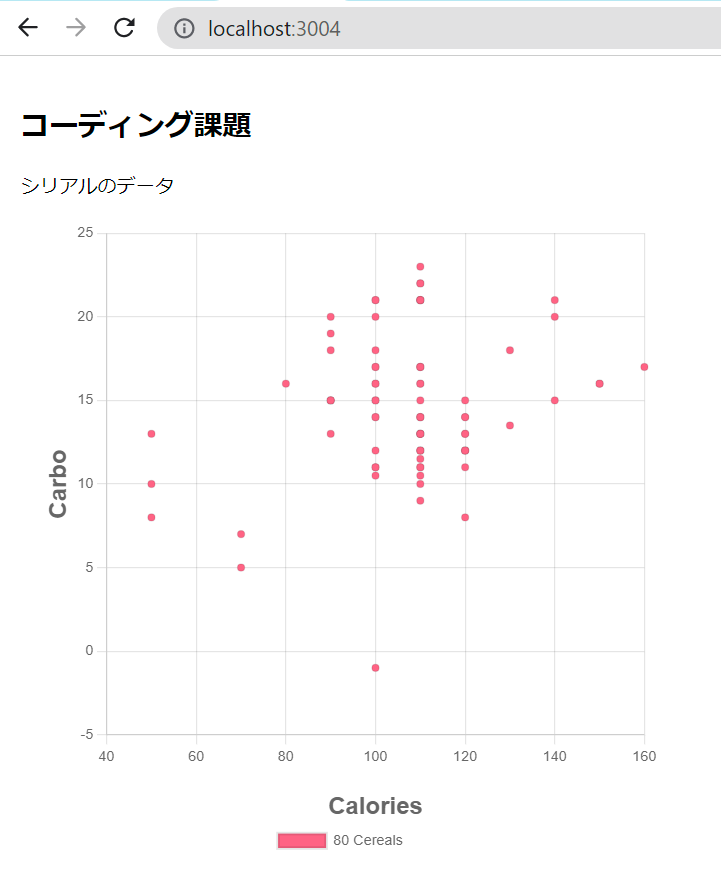

# コーディングテスト

## 課題について

アプリに１点の機能追加して頂くことが課題です。

現在のアプリケーションのスクリーンショット


Node.jsのLTSで実行確認します。

### 課題： 散布図の軸をユーザが変更できるようにする

散布図の軸をユーザが任意に変更できるようにしたい。

改修前は散布図のx軸がcalories、y軸がcarboです。
これをcerealのデータのカラムで変更したい。

- セレクトボックスを追加してx軸とy軸のカラムを選択できるようにする。
- 選んだカラムを軸に散布図を再描画できる。

対象となるカラムのリスト。数値のカラムのみです。
calories,protein,fat,sodium,fiber,carbo,sugars,potass,vitamins,shelf,weight,cups,rating

セレクトボックスの位置はお任せします。

### データセットについて

`./data`に本課題のデータセットがあります。

- `./data/cereal.json` : `GET /api/cereals`で返るデータです。 [ツール](https://www.site24x7.com/ja/tools/csv-to-json.html)でcsvからjsonに変換しました。
- `./data/cereal.csv` : 変換元のデータセットです。

このデータセットはKaggleからダウンロードしました。
該当のページにデータの詳細が載っていますのでご参照ください。
<https://www.kaggle.com/datasets/crawford/80-cereals>

License: CC BY-SA 3.0

### そのほかの機能追加・改善案

この先はオプションです。
もし追加できていたら加点されます。

このアプリは研究者がデータを眺めて`rating`が高くなる要因の気付きを得るためのものと仮定します。
その用途で改造していただいてよいです。

例）
1. mfrが7種類あります。散布図をmfrで色分け（データセットを分ける）して表示したい。
2. クリックしたポイントのシリアルの名前(name)または詳細を表示したい。
3. データセットをテーブルで表示したい。
4. データを編集したい。
5. `window.onload`の関数が長いのでリファクタリングして処理を読みやすくしたい。
6. レスポンシブ対応
7. Next.js/React.jsでの実装に変更したい。

このほか、改善提案もOKです。


## アプリの環境について

Node.jsのExpressで作った

### Commands

アプリの実行方法です。
zipを解凍して、Nodeの環境で次のコマンドで実行できます。

```bash
# 解凍したディレクトリへ移動

# モジュールのインストール
npm i

# アプリを実行する(Hot Reloadあり)
npm start
```

### Packages

Node
- [Expressjs](https://expressjs.com/ja/): NodeのWEBフレームワーク
- [nodemon](https://www.npmjs.com/package/nodemon): For hot reload

CDN
- [Chartjs](https://www.chartjs.org/docs/latest/): グラフのライブラリ
- [axios](https://github.com/axios/axios): HTTP client

ブラウザーで <http://localhost:3000/>をロードして、出力を確認します。

## Option

この先はQunaSysの新規事業のチームで共有している開発環境についてのまとめです。
余裕があればDockerの環境構築にも挑戦してみてください。

### Docker environment

オプションとしてDockerでの開発環境を用意してます。
こちらは利用しなくても構いません。

弊社では、アプリの開発環境は基本的にDockerで用意しています。
このアプリのImageは[dockerhub](https://hub.docker.com/_/node?tab=description)からNodejsのLTSのalpineを利用しています。

#### Docker環境の用意

好きなようにDocker環境を用意してください。
個人的にはDocker Desktopが好きです。

- Windows : [Windows に Docker Desktop をインストール](https://docs.docker.jp/docker-for-windows/install.html)
- Mac : [Mac に Docker Desktop をインストール](https://docs.docker.jp/docker-for-mac/install.html)

また、VSCodeでの開発では拡張機能の[Visual Studio Code Remote - Containers](https://marketplace.visualstudio.com/items?itemName=ms-vscode-remote.remote-containers)もお勧めです。
[Developing inside a Container](https://code.visualstudio.com/docs/remote/containers)

#### Dockerの利用方法

```bash
# Dockerを立ち上げる
docker-compose up -d

# コンテナでアプリの実行
docker-compose exec npm start
```

ブラウザーで <http://localhost:3004/>をロードして、出力を確認します。
`docker-compose.yml`でポートフォワーディングの設定をしています。

```bash
# Dockerを停止する
docker-compose down
```
